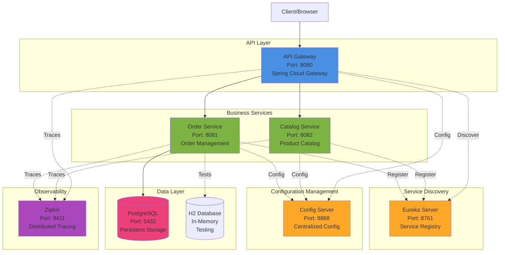
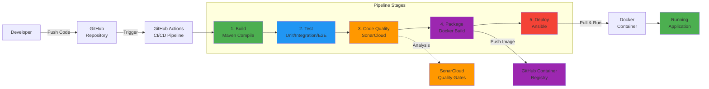

# Virtual Clothing Store - System Architecture

## High-Level Architecture Diagram



## CI/CD Pipeline Architecture



## Component Descriptions

### Microservices

1. **API Gateway (Port 8080)**
   - Entry point for all client requests
   - Routes requests to appropriate microservices
   - Implements circuit breakers (Resilience4j)
   - Load balancing across service instances

2. **Order Service (Port 8081)**
   - Handles order creation and management
   - Communicates with Catalog Service via Feign
   - Persists data to PostgreSQL
   - Comprehensive test coverage (36 tests)

3. **Catalog Service (Port 8082)**
   - Manages product catalog
   - Provides product information
   - RESTful API endpoints

4. **Eureka Server (Port 8761)**
   - Service registry for microservices discovery
   - Health monitoring of registered services
   - Dynamic service location

5. **Config Server (Port 8888)**
   - Centralized configuration management
   - Externalizes service configuration
   - Environment-specific profiles

### Infrastructure Components

6. **PostgreSQL (Port 5432)**
   - Production database
   - Persistent storage for order data
   - ACID compliance

7. **H2 Database (In-Memory)**
   - Testing database
   - Fast test execution
   - No external dependencies for tests

8. **Zipkin (Port 9411)**
   - Distributed tracing system
   - Request flow visualization
   - Performance monitoring

### CI/CD Components

9. **GitHub Actions**
   - Automated build pipeline
   - Multi-stage workflow
   - Artifact management

10. **SonarCloud**
    - Static code analysis
    - Quality gates enforcement
    - Coverage tracking (44%)

11. **Docker**
    - Containerization platform
    - Consistent deployment environment
    - Image versioning

12. **Ansible**
    - Deployment automation
    - Infrastructure as code
    - Idempotent deployments

## Technology Stack

### Backend

- Java 21
- Spring Boot 3.2.6
- Spring Cloud 2023.0.5
- Maven 3.9.6

### Testing

- JUnit 5
- Mockito
- Spring Boot Test
- JaCoCo (Coverage: 44%)

### Data

- PostgreSQL 15
- H2 Database
- Spring Data JPA
- Hibernate

### Monitoring

- Spring Boot Actuator
- Micrometer
- Zipkin
- Brave Tracing

### DevOps

- Docker & Docker Compose
- GitHub Actions
- Ansible
- SonarCloud

## Network Communication

### Service-to-Service Communication

- **Protocol**: HTTP/REST
- **Service Discovery**: Eureka Client
- **Client-Side Load Balancing**: Spring Cloud LoadBalancer
- **HTTP Client**: OpenFeign (declarative)
- **Circuit Breaker**: Resilience4j

### External Communication

- **API Endpoint**: http://localhost:8080/api/\*
- **Health Checks**: http://localhost:8081/actuator/health
- **Tracing UI**: http://localhost:9411/zipkin

## Deployment Architecture

### Local Development

- Docker Compose orchestration
- All services run in containers
- Shared network bridge (app-network)
- Volume persistence for PostgreSQL

### CI/CD Deployment

1. Code push triggers GitHub Actions
2. Build & test stages execute
3. SonarCloud analyzes code quality
4. Docker image built and tagged
5. Image pushed to GitHub Container Registry
6. Ansible pulls image and deploys container
7. Health check validates deployment

## Resilience Patterns

### Circuit Breaker

- Implemented in API Gateway
- Fallback mechanisms for service failures
- Configurable thresholds

### Service Discovery

- Dynamic service registration
- Heartbeat health checks
- Automatic service deregistration on failure

### Health Monitoring

- Spring Boot Actuator endpoints
- Docker health checks
- Liveness and readiness probes

## Security Considerations

### Current Implementation

- In-memory authentication (development)
- Environment-based configuration
- Docker network isolation

### Production Recommendations

- OAuth2/JWT authentication
- HTTPS/TLS encryption
- Secrets management (Vault/AWS Secrets Manager)
- API rate limiting
- Input validation and sanitization

## Scalability

### Horizontal Scaling

- Stateless microservices design
- Multiple instances per service
- Load balancing via API Gateway
- Database connection pooling

### Vertical Scaling

- JVM heap configuration
- Container resource limits
- Database optimization

## Data Flow Example: Create Order

```
1. Client → API Gateway (POST /api/orders)
2. API Gateway → Eureka (discover Order Service)
3. API Gateway → Order Service (forward request)
4. Order Service → Catalog Service (validate product, via Feign)
5. Order Service → PostgreSQL (persist order)
6. Order Service → Zipkin (send trace)
7. Order Service → API Gateway (return response)
8. API Gateway → Client (return order confirmation)
```

## References

For more details, see:

- [README.md](../README.md) - Quick start guide
- [docker-compose.yml](../docker-compose.yml) - Service orchestration
- [AI_INTERACTION_LOG.md](../AI_INTERACTION_LOG.md) - Testing documentation
- [ansible/README.md](../ansible/README.md) - Deployment guide
